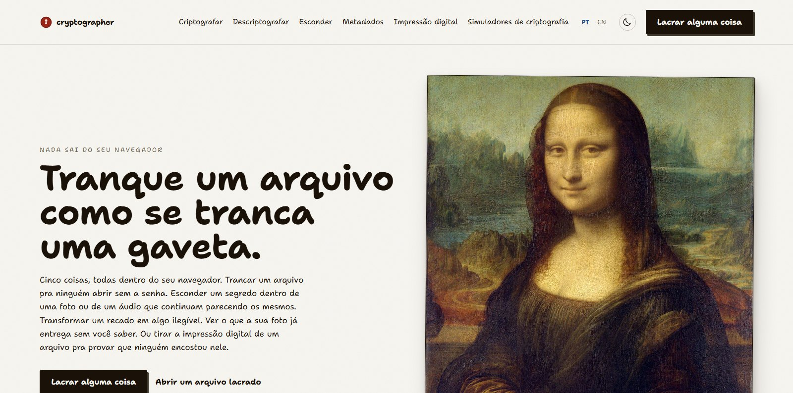
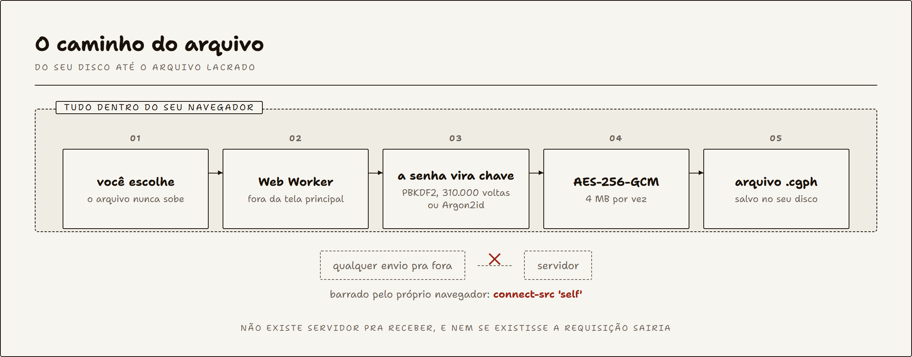
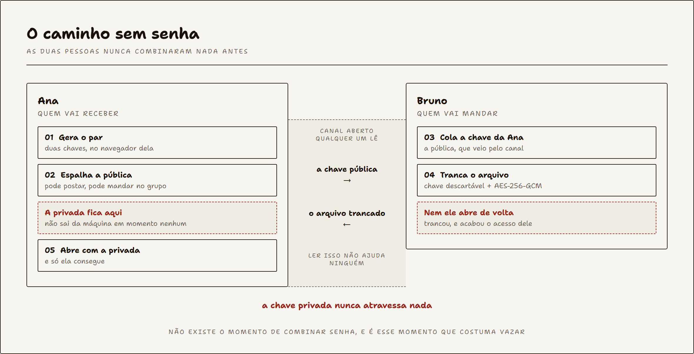
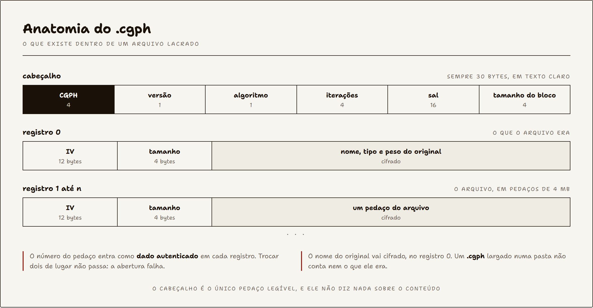

# Cryptographer

Criptografia que roda inteira dentro do navegador. Sem conta, sem banco de dados, sem servidor.

[](https://github.com/Pedroaruana/Cryptographer/actions/workflows/ci.yml)


[](https://cryptographer-seven.vercel.app/)

**[cryptographer-seven.vercel.app](https://cryptographer-seven.vercel.app/)**



## Funcionalidades

- **Lacrar** um arquivo ou uma mensagem com AES-256-GCM. Sai um `.cgph` ou um `.zip` com senha, que abre no 7-Zip de qualquer computador
- **Abrir** de volta com a mesma senha
- **Chaveiro**: gerar um par de chaves e trancar um arquivo pra uma pessoa específica, sem precisar combinar senha com ela antes. E repartir um segredo em partes que só remontam juntas
- **Esconder** um segredo dentro dos pixels de um PNG ou das amostras de um WAV. O arquivo continua abrindo normal em qualquer programa, carregando o segredo dentro
- **Metadados**: ver o que a sua foto entrega sem você saber, câmera, data e a coordenada de GPS de onde foi tirada, e apagar isso
- **Impressão digital**: SHA-1, SHA-256, SHA-384 e SHA-512 de um arquivo ou texto. Também assinar, pra provar quem fez, e selar com senha, pra provar que veio de quem sabe o combinado
- **Simuladores**: oito bancadas, das 22 cifras clássicas à troca de chaves de Diffie-Hellman e à comparação entre AES-CBC e AES-GCM

Tudo em português e inglês, com tema claro e escuro. Depois da primeira visita o site fica guardado no navegador e **abre sem internet**, com tudo funcionando.

## Como funciona

O arquivo nunca sai da máquina. Não é promessa, é o navegador que impede: a política de segurança do site declara `connect-src 'self'`, então qualquer tentativa de enviar alguma coisa pra fora é bloqueada antes de sair.



A criptografia roda num Web Worker pra tela não travar em arquivo grande, e o arquivo é lido em pedaços de 4 MB em vez de tudo de uma vez.

Como nada depende de servidor, um service worker guarda o site inteiro no navegador na primeira visita. Da segunda em diante ele abre com a internet desligada, e um teste desliga a rede de verdade pra conferir que essa frase continua sendo verdade.

### Quando não dá pra combinar senha

Senha combinada por fora é o ponto mais frágil de qualquer arquivo trancado, porque esse combinado acontece no WhatsApp, no email ou no telefone. O chaveiro tira esse momento da jogada.



A troca é ECDH na curva P-256, com uma chave descartável por arquivo e HKDF antes de chegar no AES. São dois pares e não um: trocar chave e assinar são trabalhos diferentes, e usar a mesma chave pros dois é erro conhecido.

### O formato .cgph



O arquivo do chaveiro é um formato irmão, o `.cgpk`. Muda só o cabeçalho, que guarda a chave descartável em vez do sal e das iterações; os registros são os mesmos.

Os desenhos acima saem de [`scripts/diagramas.mjs`](scripts/diagramas.mjs), então dá pra refazer eles quando o formato mudar.

## Stack

| | |
|---|---|
| Interface | React 19, React Router 7, Tailwind CSS 4 |
| Build | Vite 7, TypeScript 5.9 |
| Criptografia | Web Crypto API do próprio navegador, `hash-wasm` para Argon2id, `@zip.js/zip.js` para o ZIP com senha |
| Testes | Vitest no núcleo, Playwright nas telas |
| Qualidade | Biome, GitHub Actions |
| Hospedagem | Vercel, só arquivo estático |

Nenhuma biblioteca de criptografia caseira. Tudo que embaralha byte é Web Crypto ou implementação auditada.

## Arquitetura

```
src/
  crypto/      o núcleo, sem nenhuma referência a tela
    format.ts    o contrato: bytes, tamanhos, versão do formato
    core.ts      lacrar e abrir arquivo
    keys.ts      par de chaves, trancar pra alguém e assinar
    shamir.ts    repartir um segredo em partes
    hmac.ts      o selo com senha
    armor.ts     bytes viram texto de copiar e colar
    text.ts      lacrar e abrir mensagem
    archive.ts   o ZIP com senha
    stego.ts     esconder em imagem
    stegoWav.ts  esconder em áudio
    classic.ts   as 22 cifras clássicas
    hash.ts      as impressões digitais
    worker.ts    o que roda fora da tela principal
  hooks/       a ponte entre a tela e o worker
  components/  as peças de tela
  pages/       as telas
  i18n/        os dois dicionários, com o mesmo formato
  lib/         metadados EXIF, tipos de arquivo, cabeçalho das páginas
```

A regra que segurou tudo: `src/crypto` não sabe que existe tela. Não importa React, não toca no DOM. É por isso que dá pra testar o núcleo inteiro sem abrir navegador nenhum, e é por isso que o mesmo código roda no Web Worker sem adaptação.

O build também gera o HTML das dez telas em arquivo pronto, porque robô de busca em geral não roda JavaScript e ia encontrar uma página em branco.

## Rodando

```bash
npm install
npm run dev
```

## Testes

```bash
npm test          # 126 testes no núcleo, sem navegador
npm run test:e2e  # 26 testes abrindo o site e clicando
```

Os testes do núcleo conferem contra vetor oficial: o SHA-256 de `abc` tem que dar exatamente o valor do padrão. Os testes de tela lacram um arquivo, baixam, abrem de volta e comparam byte por byte.

Da primeira vez o Playwright precisa do navegador: `npx playwright install chromium`.

## Dificuldades

**A tela ficou branca e eu não achava.** Era um `useEffect` de uma linha que voltava o valor do `scrollTo`, e o React tentava usar aquilo como função de limpeza. Uma linha. Passei um tempo bom procurando em tudo quanto é lugar antes de olhar pra ela.

**A lupa da Mona Lisa foi a parte mais teimosa.** Tentei fazer o recorte redondo com máscara de CSS e o navegador ficava repetindo a máscara pela imagem inteira, ficava horrível. Só funcionou quando parei de insistir no CSS e fui recortar dentro do próprio canvas. Aí de quebra deu pra aumentar de verdade, e ficou parecendo lente em vez de buraco.

**O resultado travava em 0%.** Se a pessoa trocasse de aba durante a criptografia, o arquivo ficava preso pra sempre. Descobri que o `requestAnimationFrame` para de rodar em aba escondida, e eu tinha colocado a entrega do resultado dentro dele. O número na tela pode depender dele, o resultado não.

**O PNG que não entrava.** Eu comparava o nome do arquivo com uma lista de tipos MIME, então `foto.png` nunca ia bater com `image/png`. Levei um susto porque parecia um problema grande e era comparação errada.

**O cache cheio que não servia pra nada.** Pra fazer o site abrir sem internet, o service worker guardava todos os arquivos certinho, e na hora de usar não achava nenhum. As respostas vêm com `Vary: Origin`, e o pedido que eu tinha guardado não trazia o mesmo `Origin` do pedido que o navegador faz depois, então nada casava. Uma opção a mais no `caches.match` resolveu, e isso ia acontecer no ar igual.

**O idioma que mudou sozinho no servidor.** No último commit, o gerador de HTML rodava aqui e saía em português, rodava no GitHub e saía em inglês. É que o Node também tem `navigator`, e eu estava deixando o ambiente decidir em vez de mandar. Isso eu nem ia perceber, quem pegou foi um teste.

## Licença

MIT. Ver [LICENSE](LICENSE).
